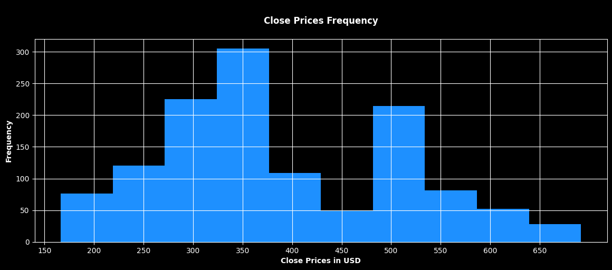
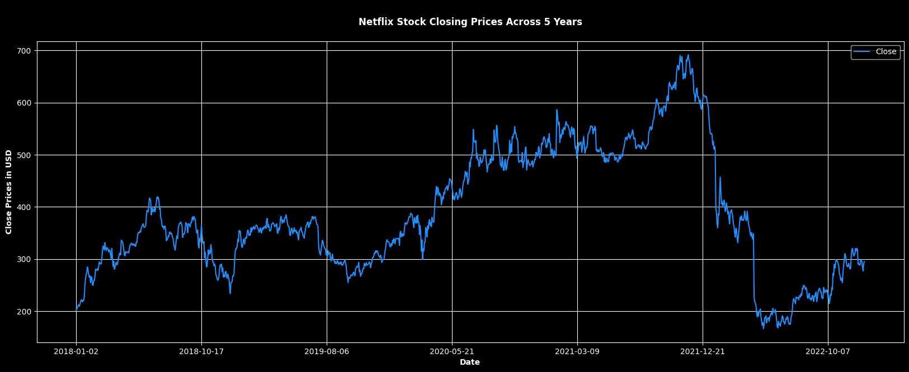
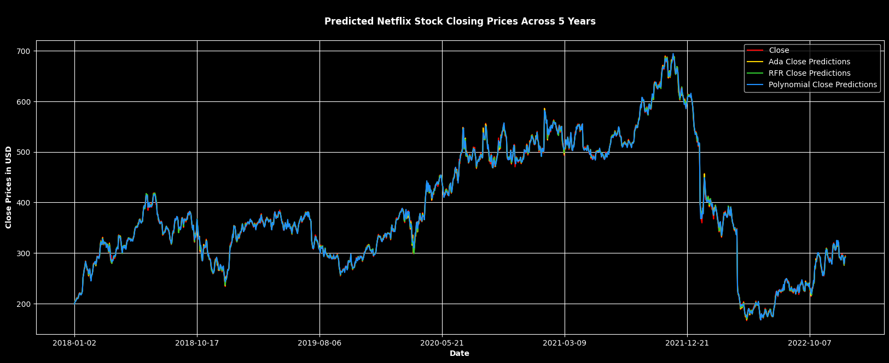

# Netflix Stock Price Prediction ML Project

A comprehensive machine learning project for predicting Netflix (NFLX) stock prices using multiple regression models. This project implements and compares three different ML algorithms to forecast stock closing prices based on historical market data.

## Project Overview

This project analyzes Netflix stock data from **January 2, 2018 to December 30, 2022** (1,259 trading days) and implements three machine learning models to predict closing prices using Open, High, and Low price features.

## Dataset

### Data Source and Description

The dataset was collected from [Yahoo Finance](https://finance.yahoo.com/) and contains Netflix (NFLX) stock data spanning from January 2nd, 2018 to December 30th, 2022, with daily trading intervals.

### Dataset Attributes

-   **Open**: The price from the first transaction of a business day
-   **High**: The highest price at which a stock is traded during the business day
-   **Low**: The lowest price at which a stock is traded during the business day
-   **Close**: The last price anyone paid for a share of stock during a business day
-   **Adj Close**: The closing price after adjustments for all applicable splits and dividend distributions
-   **Volume**: The number of shares traded in a stock (indicates market strength)

All prices are in USD.

### Dataset Visualizations

**Price Distribution Analysis**

_Distribution of Netflix closing prices (2018-2022) showing two main peaks around $300-350 and $500-550._

**Historical Price Trends**

_Netflix stock price evolution (2018-2022) showing volatility from ~$200 to ~$700._

## Project Structure

```
├── Netflix Stock Price Prediction.ipynb  # Main analysis notebook
├── NFLX.csv                              # Raw stock data
├── NFLX_Final.csv                        # Processed data with predictions
├── imgs/                                 # Generated visualizations
│   ├── close_prices_frequency.png        # Price distribution histogram
│   ├── nflx_stock_price.png              # Historical price trends
│   └── final_output.png                  # Model comparison chart
├── requirements.txt                      # Python dependencies
└── README.md                             # This file
```

## Technical Details

### Data Preprocessing

-   **Features Used**: Open, High, Low prices
-   **Target Variable**: Close price
-   **Train/Test Split**: 80/20 ratio
-   **Data Cleaning**: Removed Volume and Adj Close columns (redundant)

### Model Evaluation Metrics

-   **MSE (Mean Squared Error)**: Primary accuracy metric
-   **MAPE (Mean Absolute Percentage Error)**: Stock prediction standard
-   **R² Score**: Coefficient of determination
-   **Training Time**: Computational efficiency measure

### Libraries Used

-   pandas
-   numpy
-   matplotlib
-   scikit-learn

### Models Implemented

#### 1. Random Forest Regression

-   **Hyperparameter Tuning**: Randomized Search CV with 200 iterations
-   **Best Parameters**: 500 estimators, max_depth=9, min_samples_split=2, min_samples_leaf=1
-   **Performance**:
    -   MSE: 22.67
    -   MAPE: 99.62%
    -   Training Score: 99.97%
    -   Testing Score: 99.85%
    -   Training Time: 100.06s

#### 2. Polynomial Regression (with Elastic Net Regularization)

-   **Best Degree**: 1 (linear relationship)
-   **Regularization**: Elastic Net (α=1.0, l1_ratio=0.5)
-   **Performance**:
    -   MSE: 15.42 (Best)
    -   MAPE: 99.62%
    -   Training Score: 99.88%
    -   Testing Score: 99.90%
    -   Training Time: 0.37s (Fastest)

#### 3. AdaBoost Regression

-   **Base Estimator**: Best Random Forest model
-   **N Estimators**: 50
-   **Performance**:
    -   MSE: 22.70
    -   MAPE: 99.62% (Best)
    -   Training Score: 99.98%
    -   Testing Score: 99.85%
    -   Training Time: 48.17s

## Usage

1. **Clone the repository**:

    ```bash
    git clone https://gitlab.com/Momad-Y/nflx-stock-price-prediction.git
    ```

2. **Navigate to the project directory**:

    ```bash
    cd nflx-stock-price-prediction
    ```

3. **Install the required dependencies** (using the [requirements.txt](requirements.txt) file):

    ```bash
    pip install -r requirements.txt
    ```

4. **Run the Jupyter Notebook**: The project is implemented in the [Netflix Stock Price Prediction.ipynb](Netflix%20Stock%20Price%20Prediction.ipynb) file.

## Results and Model Comparison

**Final Model Predictions Visualization**

_Comparison of all three models (Random Forest, Polynomial Regression, and AdaBoost) against actual Netflix stock prices. All models show excellent accuracy in tracking the actual price movements._

### Key Results

-   **Best Overall Model**: Polynomial Regression (lowest MSE: 15.42)
-   **Fastest Model**: Polynomial Regression (0.37s training time)
-   **Most Accurate MAPE**: AdaBoost (99.62%)
-   **All models achieved >99.6% accuracy** in predicting stock prices

### Model Performance Summary

| Model                 | MSE   | MAPE   | Training Score | Testing Score | Training Time |
| --------------------- | ----- | ------ | -------------- | ------------- | ------------- |
| Random Forest         | 22.67 | 99.62% | 99.97%         | 99.85%        | 100.06s       |
| Polynomial Regression | 15.42 | 99.62% | 99.88%         | 99.90%        | 0.37s         |
| AdaBoost              | 22.70 | 99.62% | 99.98%         | 99.85%        | 48.17s        |

### Key Insights

1. **Polynomial Regression** emerged as the best model with the lowest MSE (15.42)
2. **All models achieved exceptional accuracy** (>99.6% MAPE), indicating strong predictive capability
3. **Linear relationship** (degree=1) was optimal for polynomial regression
4. **Netflix stock showed significant volatility** with prices ranging from ~$200 to ~$700
5. **Models successfully captured** both upward trends (2018-2021) and sharp declines (2022)

The project demonstrates the effectiveness of ensemble and regression methods for financial time series prediction, with all models showing remarkable accuracy in forecasting Netflix stock prices.

## Author

**Mohamed Youssef Abdelnasser** - 211001821

## License

This project is licensed under the MIT License - see the [LICENSE](LICENSE) file for details.

## References

-   [Yahoo Finance](https://finance.yahoo.com/) for providing the stock data
-   [scikit-learn](https://scikit-learn.org/) for providing the machine learning models
-   [pandas](https://pandas.pydata.org/) for providing the data manipulation and analysis
-   [numpy](https://numpy.org/) for providing the numerical computing
-   [matplotlib](https://matplotlib.org/) for providing the data visualization
