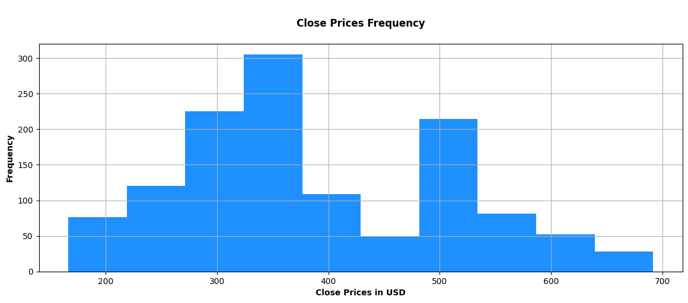
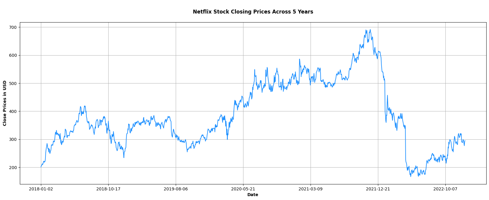
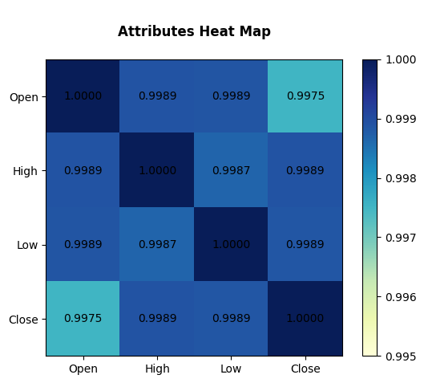
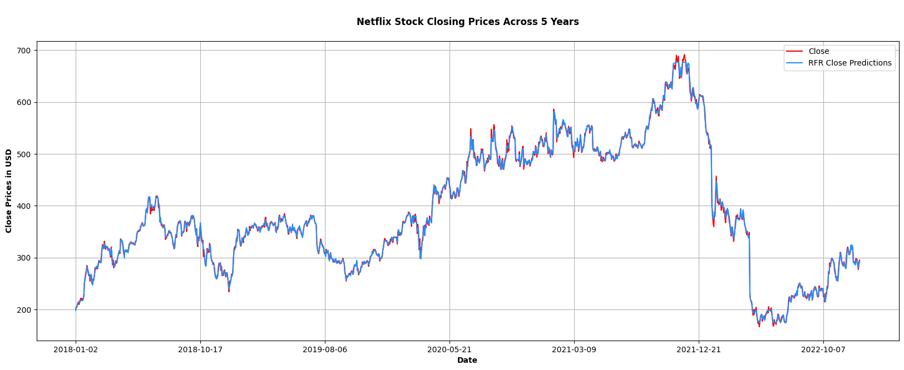
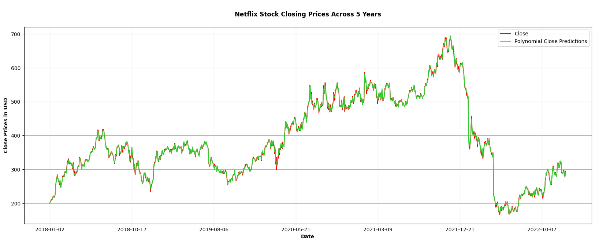
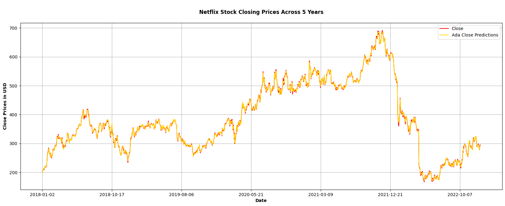
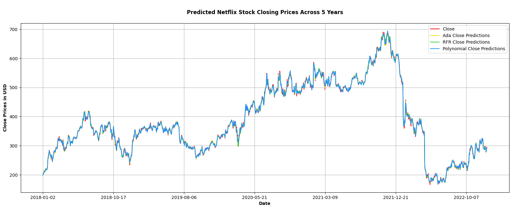

# Netflix Stock Price Prediction

A comprehensive machine learning project for predicting Netflix (NFLX) stock prices using multiple regression models. This project implements and compares three different ML algorithms to forecast stock closing prices based on historical market data.

## Project Overview

This project analyzes Netflix stock data from **January 2, 2018 to December 30, 2022** (1,259 trading days) and implements three machine learning models to predict closing prices using Open, High, and Low price features.

The analysis is available as an interactive notebook (`main.ipynb`) and as a reproducible CLI script (`main.py`) that trains all models, writes predictions, and regenerates plots.

## Rubrics

1. **Discussion**
2. **Implementation**
    1. **Dataset Validation** (within the scope or not) [10]
        1. Statistical Analysis
        2. **Data Cleaning**
            1. Insert imputer (fill the missing values)
            2. Encode if required
            3. Drop unnecessary columns
    2. **Visualization** [20]
        1. Univariate Exploration
        2. Bivariate Exploration
        3. Multivariate Exploration
    3. **Preprocessing** [30]
        1. Feature normalization
        2. K-Fold utilization
        3. Regularization test [LASSO, ELASTIC NET]
    4. **Evaluation** [30]
        1. Compare between two different models and choose the best
        2. Apply GridSearch CV
    - Extra Work Bonus for Better Effort
3. **Documentation in notebooks** [10]

## Dataset

### Data Source and Description

The dataset was collected from [Yahoo Finance](https://finance.yahoo.com/) and contains Netflix (NFLX) stock data spanning from January 2nd, 2018 to December 30th, 2022, with daily trading intervals.

Raw data lives in [`data/NFLX.csv`](data/NFLX.csv). After training, model predictions are appended and saved to [`data/NFLX_Final.csv`](data/NFLX_Final.csv).

### Dataset Attributes

- **Open**: The price from the first transaction of a business day
- **High**: The highest price at which a stock is traded during the business day
- **Low**: The lowest price at which a stock is traded during the business day
- **Close**: The last price anyone paid for a share of stock during a business day
- **Adj Close**: The closing price after adjustments for all applicable splits and dividend distributions
- **Volume**: The number of shares traded in a stock (indicates market strength)

All prices are in USD.

### Dataset Visualizations

**Price Distribution Analysis**

_Distribution of Netflix closing prices (2018-2022) showing two main peaks around $300-350 and $500-550._

**Historical Price Trends**

_Netflix stock price evolution (2018-2022) showing volatility from ~$200 to ~$700._

**Feature Correlation Heatmap**

_Strong correlation between Open, High, Low, and Close prices, confirming their predictive value._

## Project Structure

```
├── main.ipynb                            # Main analysis notebook
├── main.py                               # CLI script to train models and generate outputs
├── data/
│   ├── NFLX.csv                          # Raw stock data
│   └── NFLX_Final.csv                    # Processed data with model predictions
├── imgs/                                 # Generated visualizations
│   ├── close_prices_frequency.png        # Price distribution histogram
│   ├── nflx_stock_price.png              # Historical price trends
│   ├── correlation_heatmap.png           # Feature correlation matrix
│   ├── random_forest_predictions.png     # Random Forest vs actual close
│   ├── polynomial_predictions.png        # Polynomial Regression vs actual close
│   ├── ada_boost_predictions.png         # AdaBoost vs actual close
│   └── final_output.png                  # All models compared on one chart
├── requirements.txt                      # Python dependencies
├── Netflix Stock Price Prediction.pdf    # Project report
└── README.md                             # This file
```

## Technical Details

### Data Preprocessing

- **Features Used**: Open, High, Low prices
- **Target Variable**: Close price
- **Train/Test Split**: 80/20 ratio
- **Data Cleaning**: Removed Volume and Adj Close columns (redundant for this dataset; Close equals Adj Close on all 1,259 records)
- **Date Encoding**: Dates converted to numeric day offsets from the Unix epoch for modeling

### Model Evaluation Metrics

- **MSE (Mean Squared Error)**: Primary accuracy metric
- **MAPE (Mean Absolute Percentage Error)**: Stock prediction standard
- **R² Score**: Coefficient of determination (reported as training/testing score percentages)
- **Training Time**: Computational efficiency measure

### Libraries Used

Core ML and data stack:

- pandas
- numpy
- matplotlib
- scikit-learn

See [`requirements.txt`](requirements.txt) for the full pinned environment (including Jupyter support for the notebook).

### Models Implemented

#### 1. Random Forest Regression

- **Hyperparameter Tuning**: Randomized Search CV with 5-fold cross-validation (200 iterations)
- **Best Parameters**: 500 estimators, max_depth=9, min_samples_split=2, min_samples_leaf=1
- **Performance**:
    - MSE: 22.67
    - MAPE: 99.62%
    - Training Score: 99.97%
    - Testing Score: 99.85%
    - Training Time: 88.20s



#### 2. Polynomial Regression (with Elastic Net Regularization)

- **Best Degree**: 1 (linear relationship)
- **Regularization**: Elastic Net (α=1.0, l1_ratio=0.5)
- **Performance**:
    - MSE: 15.42 (Best)
    - MAPE: 99.62%
    - Training Score: 99.88%
    - Testing Score: 99.90%
    - Training Time: 0.50s (Fastest)



#### 3. AdaBoost Regression

- **Base Estimator**: Best Random Forest model
- **N Estimators**: 50
- **Performance**:
    - MSE: 22.48
    - MAPE: 99.62% (Best)
    - Training Score: 99.98%
    - Testing Score: 99.85%
    - Training Time: 40.76s



## Usage

1. **Clone the repository**:

    ```bash
    git clone https://github.com/Momad-Y/NFLX-Stock-Price-Prediction.git
    cd NFLX-Stock-Price-Prediction
    ```

2. **Create a virtual environment** (recommended):

    ```bash
    python -m venv .venv
    source .venv/bin/activate
    ```

3. **Install the required dependencies**:

    ```bash
    pip install -r requirements.txt
    ```

4. **Run the pipeline** (choose one):

    **Option A — Python script** (trains models, saves CSV, and writes plots to `imgs/`):

    ```bash
    python main.py
    ```

    Useful CLI flags:

    ```bash
    python main.py --help              # List all options
    python main.py --no-plots          # Skip plot generation
    python main.py --show-plots        # Display plots interactively
    python main.py -i data/NFLX.csv -o data/NFLX_Final.csv
    python main.py --rf-iter 200 -v    # Verbose Random Forest search
    ```

    **Option B — Jupyter Notebook**:

    ```bash
    jupyter notebook main.ipynb
    ```

## Results and Model Comparison

**Final Model Predictions Visualization**

_Comparison of all three models (Random Forest, Polynomial Regression, and AdaBoost) against actual Netflix stock prices. All models show excellent accuracy in tracking the actual price movements._

### Key Results

- **Best Overall Model**: Polynomial Regression (lowest MSE: 15.42)
- **Fastest Model**: Polynomial Regression (0.50s training time)
- **Most Accurate MAPE**: AdaBoost (99.62%)
- **All models achieved >99.6% accuracy** in predicting stock prices

### Model Performance Summary

| Model                 | MSE   | MAPE   | Training Score | Testing Score | Training Time |
| --------------------- | ----- | ------ | -------------- | ------------- | ------------- |
| Random Forest         | 22.67 | 99.62% | 99.97%         | 99.85%        | 88.20s        |
| Polynomial Regression | 15.42 | 99.62% | 99.88%         | 99.90%        | 0.50s         |
| AdaBoost              | 22.48 | 99.62% | 99.98%         | 99.85%        | 40.76s        |

### Key Insights

1. **Polynomial Regression** emerged as the best model with the lowest MSE (15.42)
2. **All models achieved exceptional accuracy** (>99.6% MAPE), indicating strong predictive capability
3. **Linear relationship** (degree=1) was optimal for polynomial regression
4. **Netflix stock showed significant volatility** with prices ranging from ~$200 to ~$700
5. **Models successfully captured** both upward trends (2018-2021) and sharp declines (2022)

The project demonstrates the effectiveness of ensemble and regression methods for financial time series prediction, with all models showing remarkable accuracy in forecasting Netflix stock prices.

## Author

**Mohamed Youssef Abdelnasser** - 211001821

## License

This project is licensed under the MIT License - see the [LICENSE](LICENSE) file for details.

## References

- [Yahoo Finance](https://finance.yahoo.com/) for providing the stock data
- [scikit-learn](https://scikit-learn.org/) for providing the machine learning models
- [pandas](https://pandas.pydata.org/) for providing the data manipulation and analysis
- [numpy](https://numpy.org/) for providing the numerical computing
- [matplotlib](https://matplotlib.org/) for providing the data visualization
